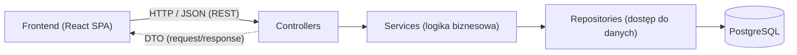
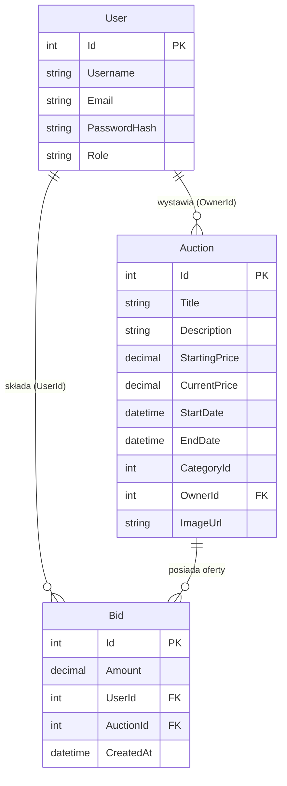

# 📄 Dokumentacja techniczna — Rozproszony System Aukcyjny (REST API)

Projekt zaliczeniowy z przedmiotu **Tworzenie usług sieciowych REST**.

- **Repozytorium kodu:** https://github.com/mlrodya/tworzenie-uslug-sieciowych-REST
- **Frontend (Vercel):** https://tworzenie-uslug-sieciowych-rest.vercel.app

**Zespół projektowy:**
- Vieronika Shcherban — baza danych, autoryzacja JWT
- Maciej Jagodziński — logika biznesowa (aukcje, licytacje), paginacja
- Mikhail Rodia — frontend (React), integracja API, konteneryzacja (Docker)

Spis treści:
1. [Opis systemu](#1-opis-systemu)
2. [Stos technologiczny](#2-stos-technologiczny)
3. [Opis architektury](#3-opis-architektury)
4. [Model danych (diagram ERD)](#4-model-danych-diagram-erd)
5. [Opis endpointów API](#5-opis-endpointów-api)
6. [Walidacja i obsługa błędów](#6-walidacja-i-obsługa-błędów)
7. [Bezpieczeństwo](#7-bezpieczeństwo)
8. [Instrukcja uruchomienia](#8-instrukcja-uruchomienia)

---

## 1. Opis systemu

System aukcji internetowych umożliwiający użytkownikom:
- rejestrację i zarządzanie kontem,
- wystawianie przedmiotów na aukcję,
- przeglądanie dostępnych aukcji (z paginacją i filtrowaniem),
- składanie ofert (licytację) z walidacją reguł biznesowych,
- podgląd historii ofert dla aukcji.

Wszystkie dane przechowywane są trwale w relacyjnej bazie PostgreSQL. Interfejs użytkownika
(React SPA) komunikuje się z systemem **wyłącznie poprzez REST API** — nigdy bezpośrednio z bazą danych.

## 2. Stos technologiczny

| Warstwa | Technologia |
|---|---|
| Backend | ASP.NET Core (.NET 9) Web API |
| ORM / baza | Entity Framework Core 9 + PostgreSQL |
| Frontend | React + Vite (SPA), komunikacja przez `fetch` |
| Autoryzacja | JWT (JSON Web Tokens) + hashowanie haseł BCrypt |
| Dokumentacja API | Swagger / OpenAPI |
| Konteneryzacja | Docker / Docker Compose |
| Kontrola wersji | Git / GitHub |

## 3. Opis architektury

System zbudowano w architekturze warstwowej z wyraźnym rozdzieleniem odpowiedzialności
(odpowiednik MVC dla API): **Controller → Service → Repository → Model**.



Przepływ żądania (np. złożenie oferty):
1. **Controller** (`AuctionsController`) — odbiera żądanie HTTP `POST /api/auctions/{id}/bids`, mapuje
   ciało na DTO, zwraca odpowiedni kod statusu.
2. **Service** (`AuctionService`) — logika biznesowa: sprawdza, czy aukcja istnieje, czy trwa i czy
   oferta jest wyższa od aktualnej ceny.
3. **Repository** (`AuctionRepository`, `BidRepository`) — jedyny punkt dostępu do bazy przez EF Core.
4. **Model + DbContext** (`AppDbContext`) — encje mapowane na tabele PostgreSQL.

**Rola DTO (Data Transfer Objects):** oddzielają kontrakt API od wewnętrznych modeli bazy —
np. `UserResponseDto` nie zawiera pola `PasswordHash`, a `CreateAuctionDto` przyjmuje tylko dane
potrzebne do utworzenia aukcji.

Struktura katalogów backendu:
```
backend/
├── Controllers/   # AuthController, UsersController, AuctionsController
├── Services/      # AuctionService (logika biznesowa)
├── Repositories/  # AuctionRepository, BidRepository
├── Models/        # User, Auction, Bid (encje EF Core)
├── DTOs/          # obiekty transferu danych + walidacja
├── Data/          # AppDbContext, DbSeeder
└── Migrations/    # migracje EF Core
```

## 4. Model danych (diagram ERD)



Opis relacji:
- **User 1—N Auction** — jeden użytkownik może wystawić wiele aukcji (`Auction.OwnerId`).
- **User 1—N Bid** — jeden użytkownik może złożyć wiele ofert (`Bid.UserId`).
- **Auction 1—N Bid** — jedna aukcja może mieć wiele ofert; przechowywana jest pełna historia (`Bid.AuctionId`).

## 5. Opis endpointów API

Adres bazowy: `http://localhost:5049/api`. Format: JSON. Pełna interaktywna dokumentacja: **Swagger** pod `/swagger`.

### Użytkownicy
| Metoda | Endpoint | Opis | Kody odpowiedzi |
|---|---|---|---|
| POST | `/users` | Rejestracja nowego użytkownika | 200, 400 |
| POST | `/users/login` | Logowanie – zwraca token JWT | 200, 401 |
| GET | `/users` | Lista użytkowników | 200 |
| GET | `/users/{id}` | Dane użytkownika | 200, 404 |
| PUT | `/users/{id}` | Edycja użytkownika | 204, 400, 404 |
| DELETE | `/users/{id}` | Usunięcie użytkownika | 204, 404 |

### Aukcje
| Metoda | Endpoint | Opis | Kody odpowiedzi |
|---|---|---|---|
| GET | `/auctions` | Lista aukcji; paginacja `?page=&pageSize=`, filtr `?categoryId=` | 200 |
| GET | `/auctions/{id}` | Szczegóły aukcji | 200, 404 |
| POST | `/auctions` | Wystawienie przedmiotu | 201, 400 |
| PUT | `/auctions/{id}` | Edycja aukcji | 204, 400, 404 |
| DELETE | `/auctions/{id}` | Usunięcie aukcji | 204, 404 |

### Licytacja
| Metoda | Endpoint | Opis | Kody odpowiedzi |
|---|---|---|---|
| POST | `/auctions/{id}/bids` | Złożenie oferty | 200, 400, 404 |
| GET | `/auctions/{id}/bids` | Historia ofert dla aukcji | 200, 404 |

### Przykłady żądań i odpowiedzi

**Logowanie** — `POST /api/users/login`
```json
// żądanie
{ "email": "demo@demo.com", "password": "Password123" }

// odpowiedź 200
{
  "message": "Zalogowano pomyślnie!",
  "token": "eyJhbGciOiJIUzI1NiIsInR5cCI6IkpXVCJ9...",
  "userId": 1,
  "username": "demo",
  "role": "User"
}
```

**Złożenie oferty** — `POST /api/auctions/1/bids`
```json
// żądanie
{ "amount": 5000, "userId": 1 }

// odpowiedź 200
"Bid placed successfully"

// odpowiedź 400 (oferta nie wyższa od aktualnej ceny)
"Bid must be higher than current price"
```

**Utworzenie aukcji** — `POST /api/auctions`
```json
{
  "title": "iPhone 15 Pro",
  "description": "Stan idealny, komplet akcesoriów.",
  "startingPrice": 3000,
  "endDate": "2026-12-31T12:00:00Z",
  "categoryId": 1,
  "ownerId": 1,
  "imageUrl": "https://..."
}
```

## 6. Walidacja i obsługa błędów

- **Walidacja danych wejściowych** — Data Annotations na DTO (`[Required]`, `[EmailAddress]`,
  `[StringLength]`, `[Range]`, `[Url]`). Dzięki `[ApiController]` niepoprawne dane skutkują
  automatyczną odpowiedzią `400 Bad Request` z listą błędów, np.:
  ```json
  {
    "errors": {
      "Email": ["Niepoprawny format adresu e-mail."],
      "Password": ["Hasło musi mieć co najmniej 6 znaków."]
    }
  }
  ```
- **Reguły biznesowe** — sprawdzane w warstwie Service (oferta wyższa od ceny, aukcja musi trwać).
- **Globalna obsługa wyjątków** — middleware przechwytuje nieoczekiwane błędy i zwraca `500`
  z komunikatem JSON zamiast przerwania działania aplikacji.
- **Poprawne kody HTTP** — 200 (OK), 201 (utworzono), 204 (brak treści), 400 (błędne dane),
  401 (brak autoryzacji), 404 (nie znaleziono), 500 (błąd serwera).

## 7. Bezpieczeństwo

- **Hasła** nigdy nie są przechowywane jawnie — zapisywany jest wyłącznie **hash BCrypt**.
  Przy logowaniu hasło jest weryfikowane funkcją `BCrypt.Verify`.
- **JWT** — przy logowaniu generowany jest token JSON Web Token, przechowywany po stronie klienta
  i wykorzystywany do identyfikacji użytkownika.
- **CORS** — skonfigurowana polityka pozwalająca frontendowi komunikować się z API.

## 8. Instrukcja uruchomienia

Wymagania: **Docker**, **Node.js**, **.NET 9 SDK**.

### Krok 1 — Baza danych (PostgreSQL)
W głównym folderze projektu:
```bash
docker-compose up -d
```

### Krok 2 — Backend (API)
```bash
cd backend
dotnet run
```
Przy starcie aplikacja **automatycznie zakłada schemat bazy (migracje)** oraz **dodaje dane
startowe** (konto demo + przykładowe aukcje).
- API: `http://localhost:5049`
- Swagger: `http://localhost:5049/swagger`

### Krok 3 — Frontend
```bash
cd frontend
npm install
npm run dev
```
Aplikacja: `http://localhost:5173`

### Konto demonstracyjne
```
e-mail:  demo@demo.com
hasło:   Password123
```
